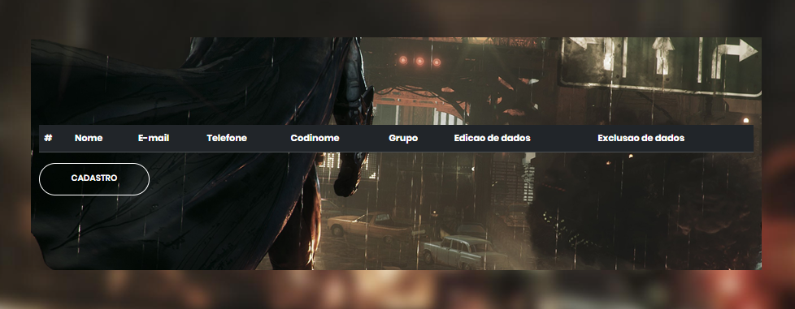

# Player Registration


This project was created based on this challenge: https://github.com/uolhost/test-backEnd-Java?tab=readme-ov-file


## Table of Contents

- [Installation](#installation)
- [Usage](#usage)
- [API Endpoints](#api-endpoints)


## Installation
1. Clone the repository:

```bash
git clone https://github.com/LeonardoSnows/Player-Registration.git
```

2. Install dependencies with Maven


## Usage

1. Start the application with Maven
2. The API will be accessible at http://localhost:8080

## API Endpoints
The API provides the following endpoints:

```markdown
POST /register - Register the players
POST /list/players - List of all players
```

## Front - Register the players


## Front - List of all players

